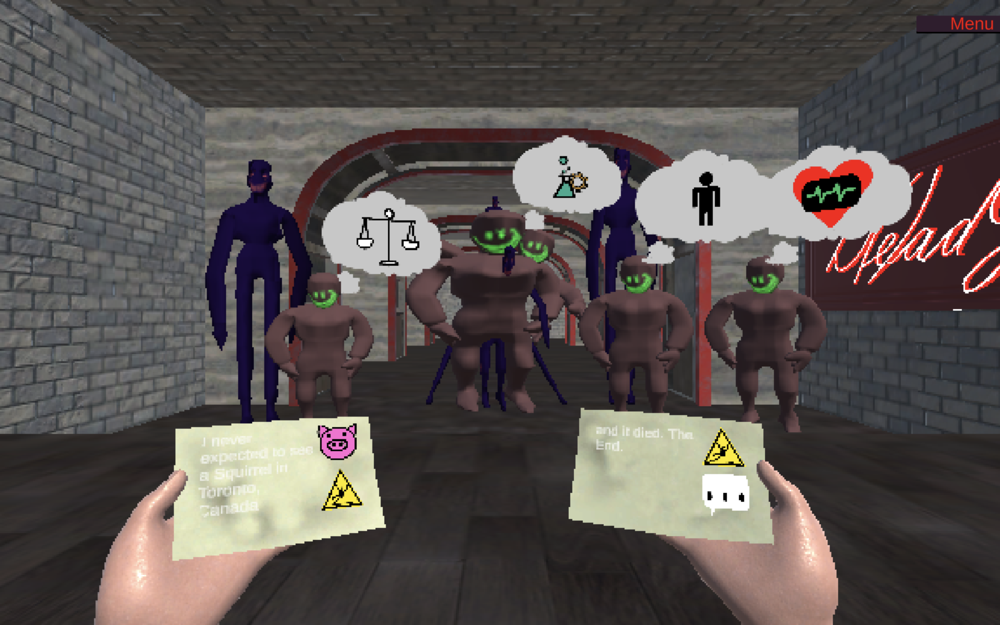

# D(e)ad Jokes

D(e)ad Jokes is a game about a comedian's nightmare trying to find the right joke to appease an evermore demanding audience.

It was developed for the [Global Game Jam 2024](https://globalgamejam.org/games/2024/dead-jokes-5) and you can [play it right now!](https://shoeffner.github.io/GGJ-24-sabelkalat/).

Use the arrow keys (or WASD) to focus your cards and swap them, tell the joke with <space> and swap the view with <tab>.

## Credits

**Game Design**
Sam Matsa (einfuehlsam)
Etienne Theurer (GranatenGecko)

**Art**
Katja Kollischon
Ares Gruber

**Audio**
Magnus Reichel

**Code**
bitowl
Tobias Lauxmann (YoghurtDrop)
Sebastian Höffner (shoeffner)

## License

The files `lostWish-*.ogg` are not covered under the CC-BY-NC-SA-4.0, instead they are licensed for this project by Magnus Reichel.
If you want to use them in your (potentially commercial) products, you can license the files directly at [Magnus' website](https://www.magnusreichel.de/product/fifth-piano/).
